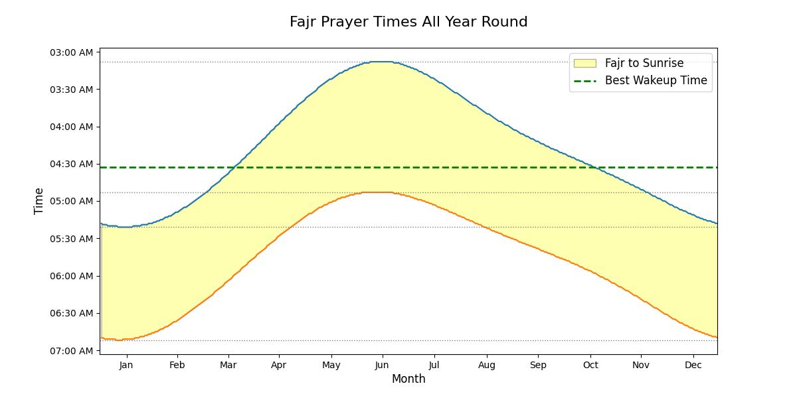

#Fajr Prayer Sleep Optimizer#

Data Source:
![https://www.islamicfinder.org/prayer-times/print-yearly-prayers/?timeInterval=year&calendarType=Gregorian&year=2020]

Calculation Method:
Egyptian General Authority of Survey
Fajr 19.5 degrees, Isha  17.5 degrees

Juristic Method:
Hanbali, Maliki, Shafi

Latitude/Longitude:
30.0771, 31.2859

Daylight Saving:
Auto
